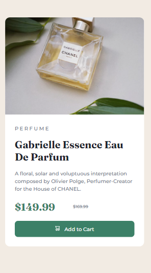
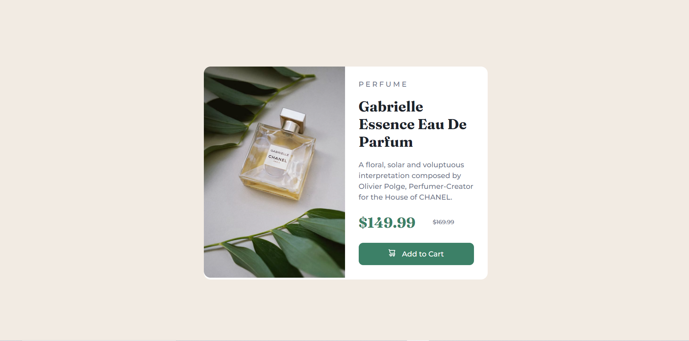

# Frontend Mentor - Product preview card component solution

This is a solution to the [Product preview card component challenge on Frontend Mentor](https://www.frontendmentor.io/challenges/product-preview-card-component-GO7UmttRfa). Frontend Mentor challenges help you improve your coding skills by building realistic projects. 

## Table of contents

- [Frontend Mentor - Product preview card component solution](#frontend-mentor---product-preview-card-component-solution)
  - [Table of contents](#table-of-contents)
  - [Overview](#overview)
    - [The challenge](#the-challenge)
    - [Screenshot](#screenshot)
    - [Links](#links)
  - [My process](#my-process)
    - [Built with](#built-with)
    - [Continued development](#continued-development)
    - [Useful resources](#useful-resources)
  - [Author](#author)
  - [Acknowledgments](#acknowledgments)

## Overview

This is **Product preview card component challenge on Frontend Mentor**.

### The challenge

Users should be able to:

- View the optimal layout depending on their device's screen size
- See hover and focus states for interactive elements

### Screenshot

### Links

- Solution URL: [Add solution URL here](https://your-solution-url.com)
- Live Site URL: [Add live site URL here](https://your-live-site-url.com)

## My process

Process is mention below to made this clone.
1. As usual created HTML file and 2 css style file and link with media queries.
2. Added all contents in order.
3. Added all kind of CSS custom properties.

### Built with

- Semantic HTML5 markup
- CSS custom properties
- CSS Grid
- Media Queries

### Continued development

I'll continue this journey because lot of exploration is out there.

### Useful resources

- [Montserrat](https://fonts.google.com/specimen/Montserrat) - This helped me for font style. I really liked this pattern and will use it going forward.
- [Fraunces](https://fonts.google.com/specimen/Fraunces) - This helped me for font style. I really liked this pattern and will use it going forward.

## Author

- Frontend Mentor - [@@codekesh](https://www.frontendmentor.io/profile/codekesh)
- Twitter - [@tulsyan_keshav](https://twitter.com/tulsyan_keshav)
- Github - [@codekesh](https://github.com/codekesh)

## Acknowledgments
I am solo player for this project. I am beginner so for learning purpose, I tried my own and I think I give my best for making this website.